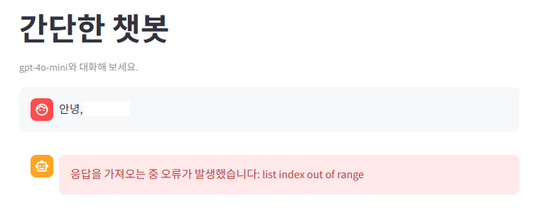

# 01 챗봇 ui 웹앱 만들기

streamlit을 활용해 간단한 챗봇 ui를 구축해 봅니다.

---

1. `.env`를 `1. LLM/01_streamlit_chatbot` 폴더로 복사합니다.

2. Visual Studio Code의 좌측 상단에서 **File - Open Folder...** 를 선택합니다.

3. `1. LLM/01_streamlit_chatbot` 폴더를 선택해서 엽니다.

4. Continue를 실행해 아래와 같이 프롬프트를 입력합니다.

   > 코드 구현을 부탁할 때는 Continue가 코드를 직접 작성할 수 있도록 **Agent 모드**를 선택하고 부탁합니다.

   ```
   간단한 대화를 할 수 있는 챗봇을 streamlit으로 구현해줘. 모델은 gpt-4o-mini를 사용하고, `.env`에서 'OPENAI_API_KEY'와 'gpt_4o_mini_BASE_URL' 2개를 불러오면 돼.
   ```

5. 챗봇이 잘 만들어졌는지 직접 확인해 봅니다.

   **확인 방법**

   1. Visual Studio Code 좌측 상단의 **Terminal - New Terminal** 선택
   2. 화면 아래에 등장한 터미널 화면에 아래 명령어 입력

      ```
      streamlit run app.py
      ```

      > 마지막의 `app.py`는 여러분의 continue가 구현해준 파일 이름을 사용하면 됩니다.

   3. 만약 브라우저가 자동으로 열리지 않으면 터미널에 있는 `http://localhost:8501`을 **Ctrl+클릭**해서 실행
   4. 서버 종료 방법은 터미널 클릭하고 `Ctrl+C`

   만약 에러가 발생하면 아래와 같이 빨간 박스의 에러 메세지를 그대로 복사해서 continue에 전달합니다.

   

6. 챗봇에 아래와 같은 기능들이 구현되어 있는지 하나씩 체크해 봅니다.

   - [ ] **메모리** : 앞에서 말한 내용을 뒤에서 기억을 유지하는가?
   - [ ] **stream** : 답변이 완료된 다음에 한번에 출력되는지 앞에서부터 순서대로 출력되는지?

   만약 위 기능들이 구현되어 있지 않다면 구현해 달라고 추가로 요청합니다.

7. 위 기능이 모두 정상적으로 구현되어 있다면 아래 기능들을 하나씩 추가해 봅시다.

   - **시스템 프롬프트** : 여러분이 직접 챗봇의 시스템 프롬프트를 작성해 continue에게 전달해 시스템 프롬프트가 적용된 챗봇을 구현해 봅니다.
   - **`temperature` 조절 기능 추가하기** : `temperature`를 사용자가 직접 조절할 수 있도록 하는 입력 ui를 추가해 봅니다.
   - **토큰 사용량 표시** : 채팅을 하는 동안 토큰이 얼마나 소모되었는지를 확인할 수 있는 ui를 추가해 봅니다. 토큰 비용을 체크하는데 도움이 됩니다.
